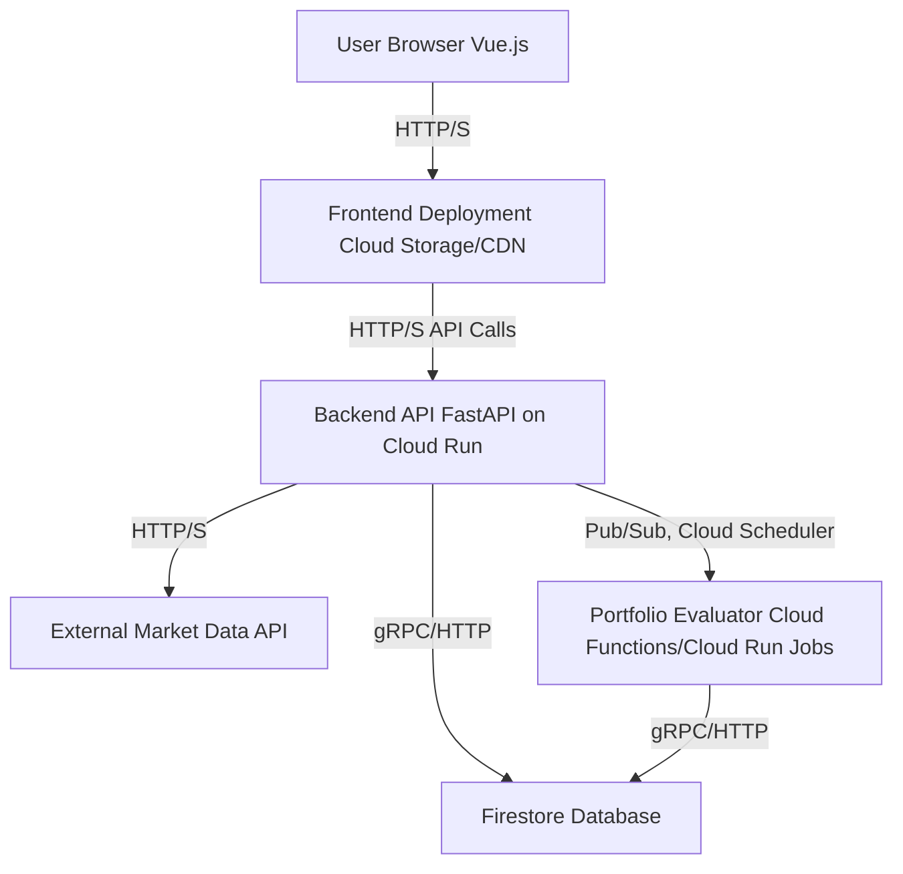

# Technical Design Document: HiveInvestor

## 1. Introduction
This document outlines the technical design for HiveInvestor, a web application providing a persistent, individual-focused stock market simulation experience. The application will utilize FastAPI for the backend, Vue.js with Tailwind CSS for the frontend, and Google Cloud Platform (GCP) for deployment and data storage.

## 2. Architecture Overview
HiveInvestor will follow a client-server architecture. The frontend (Vue.js) will interact with the backend (FastAPI) via RESTful APIs. The backend will handle business logic, data persistence (Firestore), and integration with external market data APIs.



### 2.1. Component Responsibilities
*   **Frontend (Vue.js):** User interface, user interaction, display of portfolio data, transaction forms, leaderboards.
*   **Backend API (FastAPI):** User authentication/authorization, portfolio management (create, read, update, delete), transaction processing, real-time data fetching from external APIs, exposing data to the frontend.
*   **Firestore Database:** Persistent storage for user profiles, portfolios, transactions, and leaderboard data.
*   **External Market Data API:** Provides real-time (or near real-time) stock, mutual fund, and bond prices.
*   **Portfolio Evaluator (Cloud Functions/Cloud Run Jobs):** Scheduled background process to recalculate Percentage Portfolio Gain (PPG) for all active users and update leaderboards.

## 3. Backend Design (FastAPI)

### 3.1. API Endpoints (Examples)
*   `POST /api/v1/users/register`: Register a new user.
*   `POST /api/v1/users/login`: User login, returns authentication token.
*   `GET /api/v1/portfolio/{user_id}`: Retrieve user's current portfolio.
*   `POST /api/v1/portfolio/{user_id}/trade`: Execute a trade (buy/sell).
*   `GET /api/v1/market/quote/{symbol}`: Get real-time quote for a security.
*   `GET /api/v1/leaderboard/1day`: Get 1-day PPG leaderboard.
*   `GET /api/v1/leaderboard/7day`: Get 7-day PPG leaderboard.
*   `GET /api/v1/leaderboard/30day`: Get 30-day PPG leaderboard.
*   `GET /api/v1/leaderboard/90day`: Get 90-day PPG leaderboard.

### 3.2. Data Models (Pydantic)
FastAPI will use Pydantic models for request and response validation.

```python
# Example Pydantic Models
from pydantic import BaseModel
from datetime import datetime

class User(BaseModel):
    id: str
    username: str
    email: str
    hashed_password: str
    created_at: datetime

class Portfolio(BaseModel):
    id: str
    user_id: str
    cash_balance: float
    total_value: float
    securities: dict # e.g., {"AAPL": {"quantity": 10, "avg_cost": 150.0}}
    created_at: datetime
    last_evaluated_at: datetime
    initial_capital: float = 100000.0

class Transaction(BaseModel):
    id: str
    user_id: str
    portfolio_id: str
    type: str # "BUY" or "SELL"
    symbol: str
    quantity: int
    price_per_share: float
    commission: float
    total_amount: float
    timestamp: datetime

class LeaderboardEntry(BaseModel):
    user_id: str
    username: str
    ppg: float
    rank: int
    evaluation_period: str # "1day", "7day", "30day", "90day"
```

### 3.3. Business Logic
*   **User Management:** Registration, login (JWT-based authentication), profile management.
*   **Portfolio Initialization:** New users start with $100,000 virtual cash.
*   **Trade Execution:**
    *   Validate trade (sufficient cash for buy, sufficient shares for sell).
    *   Fetch current market price from external API.
    *   Calculate commission ($10 flat fee per trade).
    *   Update cash balance and security holdings in the portfolio.
    *   Record transaction.
*   **Portfolio Valuation:** Calculate current market value of all securities using real-time data.
*   **PPG Calculation:**
    *   `PPG = ((Current Net Portfolio Value - Starting Portfolio Value) / Starting Portfolio Value) * 100`
    *   Starting Portfolio Value will be recorded at the beginning of each evaluation window (1, 7, 30, 90 days).

## 4. Frontend Design (Vue.js with Tailwind CSS)

### 4.1. Component Structure (Examples)
*   `App.vue`: Main application layout.
*   `Auth.vue`: Login and registration forms.
*   `Dashboard.vue`: Overview of portfolio, cash balance, recent activity.
*   `Portfolio.vue`: Detailed view of holdings, unrealized gain/loss.
*   `TradeForm.vue`: Component for executing buy/sell orders.
*   `Leaderboard.vue`: Displays rolling leaderboards.
*   `MarketQuote.vue`: Displays real-time security quotes.

### 4.2. State Management
Vuex or Pinia will be used for centralized state management (e.g., user authentication status, portfolio data, leaderboard data).

### 4.3. UI/UX
*   **Tailwind CSS:** For rapid and consistent styling, ensuring a modern and responsive design.
*   **Material Design Principles:** To guide the overall look and feel, ensuring intuitive user experience.
*   **Real-time Updates:** Display market data and portfolio changes with minimal delay.

## 5. Database Design (Firestore)

### 5.1. Collections
*   `users`: Stores user profiles (id, username, email, hashed_password, created_at).
*   `portfolios`: Stores portfolio details (id, user_id, cash_balance, total_value, securities map, created_at, last_evaluated_at, initial_capital).
*   `transactions`: Stores individual trade records (id, user_id, portfolio_id, type, symbol, quantity, price_per_share, commission, total_amount, timestamp).
*   `leaderboards`: Stores pre-calculated leaderboard entries for different periods (user_id, username, ppg, rank, evaluation_period, timestamp). This collection will be updated by the Portfolio Evaluator.

### 5.2. Data Access
The FastAPI backend will interact with Firestore using the official Google Cloud client libraries for Python.

## 6. External Integrations

### 6.1. Market Data API
*   A third-party API (e.g., Alpha Vantage, IEX Cloud, Finnhub) will be integrated to fetch real-time stock, mutual fund, and bond prices.
*   Considerations: API key management, rate limiting, data freshness (15-20 min delay is acceptable for simulation).

## 7. Deployment Strategy (Google Cloud Platform)

### 7.1. Services
*   **Frontend:** Hosted on Google Cloud Storage and served via Cloud CDN for low-latency global access.
*   **Backend API:** Deployed as a containerized application on Google Cloud Run. This provides serverless scalability and cost-efficiency.
*   **Database:** Firestore in Native Mode.
*   **Portfolio Evaluation:** Google Cloud Functions or Cloud Run Jobs triggered by Cloud Scheduler (via Pub/Sub) for daily recalculations.
*   **Authentication:** Firebase Authentication can be considered for user management, or a custom FastAPI implementation with JWTs.
*   **Secrets Management:** Google Secret Manager for API keys and other sensitive configurations.

### 7.2. CI/CD
*   Cloud Build can be used to automate testing, building, and deployment of both frontend and backend components.

## 8. Security Considerations
*   **Authentication:** JWT-based authentication for API access.
*   **Authorization:** Role-based access control (if applicable, though initially individual users).
*   **Data Encryption:** Data at rest (Firestore) and in transit (TLS/SSL for all communication).
*   **Input Validation:** Strict validation on all API inputs to prevent injection attacks.
*   **Secrets Management:** Use Google Secret Manager for all sensitive credentials.

## 9. Scalability
*   **Cloud Run:** Automatically scales the backend API based on traffic.
*   **Firestore:** Horizontally scalable NoSQL database.
*   **Cloud Functions/Cloud Run Jobs:** Scalable for background processing.
*   **Cloud CDN:** Distributes frontend assets globally, reducing load on origin.
